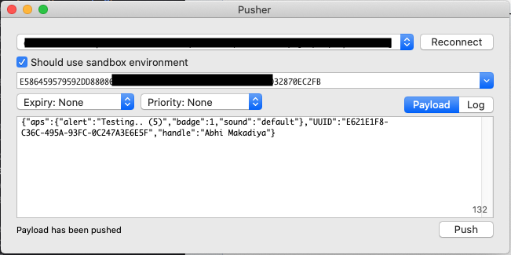

# OpenTokVideoChat
Vonage(OpenTok) video chat demo in swift

# Callkit Integration with Vonage OpenTok

This repositiry is an example project of how to integrate [Callkit](https://developer.apple.com/documentation/callkit) into OpenTok iOS SDK. Integrated with WhatsApp type picture-in-picture UI.

### Included Points
- OpenTok VideoChat Integration.
- Callkit configured with OpenTok.
- WhatsApp type picture-in-picture UI.

Use CocoaPods to install the project files and dependencies.

1. Install CocoaPods as described in [CocoaPods Getting Started](https://guides.cocoapods.org/using/getting-started.html#getting-started).
1. In Terminal, `cd` to your project directory and type `pod install`. (Sometimes, `pod update` is magical)
1. Reopen your project in Xcode using the new `*.xcworkspace` file.

### Configure and build the app
1. The application **requires** values for **API Key**, **Session ID**, and **Token**. In the sample, you can get these values at the [OpenTok Developer Dashboard](https://dashboard.tokbox.com/). For production deployment, you must generate the **Session ID** and **Token** values using one of the [OpenTok Server SDKs](https://tokbox.com/developer/sdks/server/).
1. Replace the following empty strings with the corresponding **API Key**, **Session ID**, and **Token** values in `.xcconfig`.
2. Configure VOIP certificate to Project. Create it from apple developer account.
1. Use Xcode to build and run the app on an iOS simulator or device.

### Exploring Project

 ***You will need a device to test the followings***
 
**Simulate an incoming call**
The Home screen is visible till no incomming calls received. To make it working, Fire VOIP push notificaiton to the application and accept the call.

**Use [Pusher](https://github.com/noodlewerk/NWPusher) for VOIP push **

